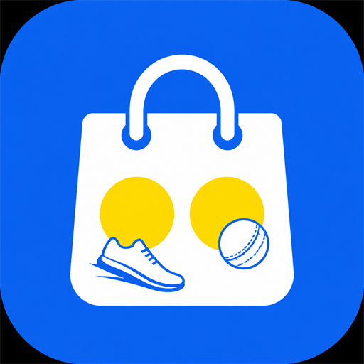
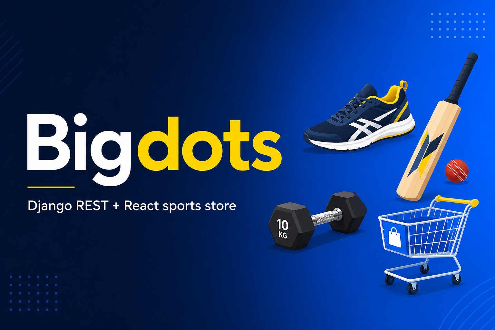

<p align="center">
  
</p>

<h1 align="center">Bigdots</h1>

<p align="center"><strong>Full-stack sports e-commerce</strong> — Django REST + React, with JWT auth, a seeded 1000+ product catalogue, and role-based admin.</p>

<p align="center">
  
</p>

<p align="center">
  
  
  
  
  
</p>

A production-style shopping experience for sports gear: search and filter, cart and wishlist, COD/online checkout, order tracking, and two admin tiers for catalogue, fulfilment, refunds and store settings.

Built as a portfolio project to show end-to-end product thinking — not just CRUD screens, but customer flows, staff workflows, and seeded realistic catalogue data (SKU, size, colour, material, dimensions, warranty).

## Why this project

- **Two storefronts, one API** — React SPA at `:5173` and Django templates at `:8000`, both talking to the same shop backend.
- **Real commerce flows** — register/login, browse 1000+ products, wishlist, cart, checkout, orders, contact/help.
- **Role-based access** — customer, store admin, and super admin with different dashboards and permissions.
- **Ops, not only UI** — order status, COD vs paid, refunds, staff accounts, and editable Call / Email / Website links.

## Features

| Area | What it covers |
|---|---|
| Catalogue | 1000+ sports products with SKU, specs, images, categories |
| Shopping | Search, filters, product details, cart, wishlist |
| Checkout | Address, COD and payment-style flow, order history |
| Customer | Auth, account page, contact / call / email / chat links |
| Store admin | Products, categories, order fulfilment, customer contact |
| Super admin | Users, refunds, catalogue delete, store settings |

## Tech stack

**Backend:** Django 5, Django REST Framework, SimpleJWT, CORS, SQLite (dev)

**Frontend:** React 18, React Router, Vite, custom CSS (Flipkart-style commerce UI)

**Roles:** `demo` customer · `admin` store staff · `superadmin` owner

## Architecture

```text
React (Vite :5173)  ──JWT──►  Django REST  /api/
                                 │
Django templates (:8000)  ───────┤
                                 ▼
                         SQLite + shop models
                    products · orders · users · settings
```

## Demo logins

| Role | Username | Password | Can do |
|---|---|---|---|
| Super admin | `superadmin` | `SuperAdmin@123` | Users, refunds, settings, delete catalogue |
| Admin | `admin` | `Admin@123` | Products, categories, order fulfilment |
| Customer | `demo` | `Demo@123` | Shop, cart, checkout, wishlist |

**Store admin** adds/edits products and categories, updates order status, marks COD as paid, and can call/email customers.

**Super admin** can do all of that, plus manage staff, refund payments, and change store contact links.

## Run locally

```bash
cd backend
.\.venv\Scripts\activate
pip install -r requirements.txt
python manage.py migrate
python manage.py seed_catalog
python manage.py runserver 8000
```

```bash
cd frontend
npm install
npm run dev
```

- Storefront (React): http://localhost:5173
- Storefront (Django): http://127.0.0.1:8000
- Django admin: http://127.0.0.1:8000/django-admin/

`seed_catalog` creates the demo accounts and more than 1000 sports products with SKU, dimensions, weight, material, colour, size, warranty and care instructions.

## Project structure

```text
backend/     Django API, JWT auth, admin, Django templates
frontend/    React + Vite storefront and admin UI
docs/        Project icon and portfolio banner
```

## Author

[Kumaresh](https://github.com/kumareshsub) · full-stack project for portfolio review
